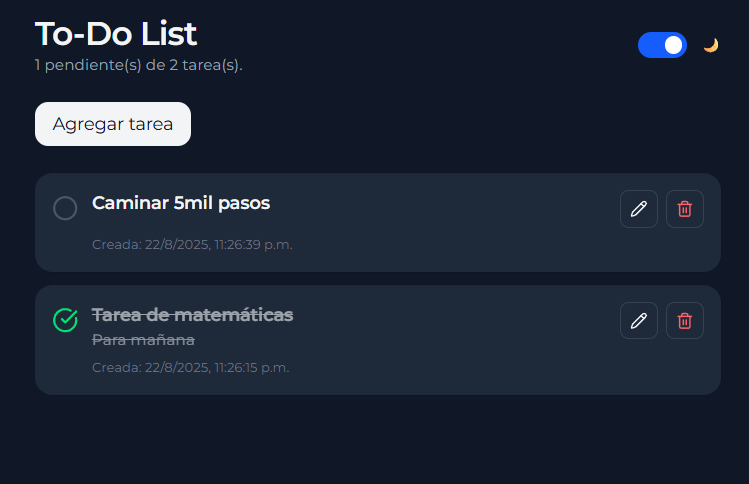

# 📝 To-Do List

Aplicación de lista de tareas desarrollada con **React + Vite + TailwindCSS**.
Permite crear, editar, marcar como completadas y eliminar tareas con una interfaz moderna y modo oscuro.

---

## 🚀 Demo



---

## ✨ Features

- ➕ **Agregar tareas** mediante un modal
- ✏️ **Editar tareas** en modal con título dinámico
- ✅ **Marcar tareas como completadas** con icono de check
- 🗑️ **Eliminar tareas** con confirmación en popup (no nativo)
- 🌙 **Modo oscuro** activable con switch
- 📱 Diseño responsive con TailwindCSS

---

## 🛠️ Tecnologías

- [React](https://react.dev/)
- [Vite](https://vitejs.dev/)
- [TailwindCSS](https://tailwindcss.com/)
- [Lucide React](https://lucide.dev/) (iconos modernos)

---

## 📦 Instalación y ejecución

Clona el repositorio:

```bash
git clone https://github.com/Snake1197/to-do-list.git
cd to-do-list
```

Instala dependencias:

```bash
npm install
```

Ejecuta el entorno de desarrollo:

```bash
npm run dev
```

Compila para producción:

```bash
npm run build
```

---

## 📂 Estructura del proyecto

```
to-do-list/
├── public/               # Recursos estáticos (favicon, imágenes)
├── src/
│   ├── components/       # Componentes reutilizables
│   │   ├── TaskList.jsx
│   │   ├── TaskItem.jsx
│   │   └── TaskForm.jsx
│   ├── App.jsx           # Componente principal
│   ├── index.css         # Estilos globales + Tailwind
│   └── main.jsx          # Punto de entrada
├── package.json
├── tailwind.config.js
└── README.md
```

---

## 📌 Autor

Creado por [Snake1197](https://github.com/Snake1197) 🐍
