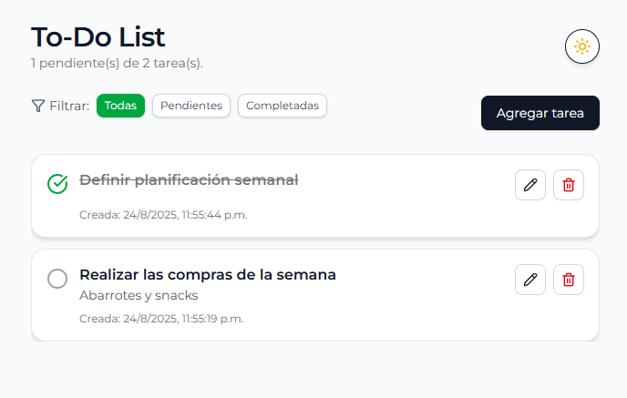
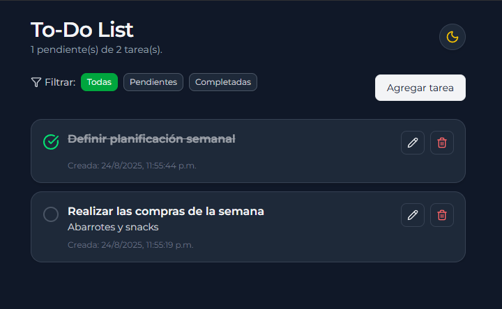
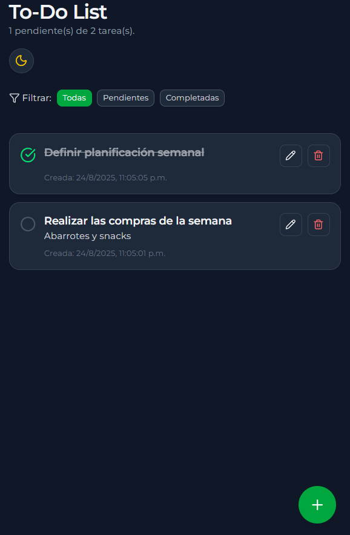
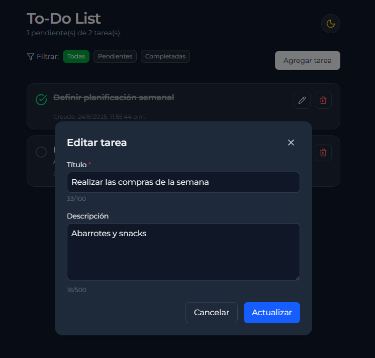
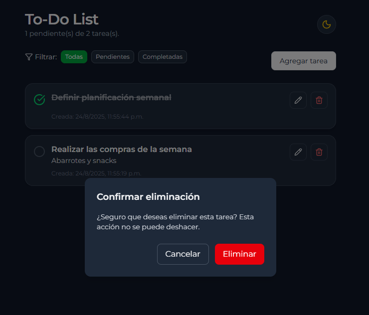

# 📝 To-Do List

Aplicación moderna de gestión de tareas construida con **React + Vite + TailwindCSS**.  
Permite crear, editar, completar y eliminar tareas con una interfaz responsiva, accesible y con soporte para modo oscuro.

---

## 🚀 Demo

A continuación se muestran algunas capturas de la aplicación en funcionamiento:

- 🖥️ Vista principal con tareas pendientes y filtros activos
  

- 🌙 Modo oscuro con contraste optimizado
  

- 📱 Vista móvil con botón flotante de “Agregar tarea”
  

- 📝 Modal de edición con campos dinámicos
  

- 🗑️ Confirmación de eliminación con diseño adaptativo
  

---

## ✨ Funcionalidades destacadas

- ➕ Agregar tareas mediante un modal limpio y accesible
- ✏️ Editar tareas con validación y sanitización de texto
- ✅ Marcar como completadas con íconos interactivos
- 🗑️ Eliminar tareas con confirmación personalizada (no nativa)
- 🌙 Modo oscuro/claro con persistencia y transición suave
- 📱 Diseño responsive optimizado para desktop y mobile
- 🔍 Filtrado de tareas por estado: todas, pendientes, completadas
- 🧠 Accesibilidad mejorada con roles, aria-labels y navegación por teclado
- 🎨 Sistema de diseño escalable con variantes y tamaños de botones

---

## 🛠️ Tecnologías utilizadas

- [React](https://react.dev/)
- [Vite](https://vitejs.dev/)
- [TailwindCSS](https://tailwindcss.com/)
- [Lucide React](https://lucide.dev/)
- ESLint + Prettier para mantener código limpio

---

## 📦 Instalación y ejecución

```bash
# Clona el repositorio
git clone https://github.com/Snake1197/to-do-list.git
cd to-do-list

# Instala dependencias
npm install

# Ejecuta en modo desarrollo
npm run dev

# Compila para producción
npm run build
```

---

## 📂 Estructura del proyecto

```
src/
├── assets/ # Recursos estáticos
├── components/ # Componentes reutilizables
│ ├── Button.jsx
│ ├── FilterButtons.jsx
│ ├── FloatingButton.jsx
│ ├── Header.jsx
│ ├── Layout.jsx
│ ├── Modal.jsx
│ ├── TaskForm.jsx
│ ├── TaskItem.jsx
│ ├── TaskList.jsx
│ ├── TaskModal.jsx
│ ├── ToggleTheme.jsx
│ └── ViewModal.jsx
├── hooks/ # Hooks personalizados
│ ├── useDarkMode.js
│ ├── useLocalStorage.js
│ └── useTasks.js
├── App.jsx # Componente principal
├── index.css # Estilos globales + Tailwind
└── main.js # Punto de entrada
```

---

## 🧪 Detalles técnicos

- Componentes desacoplados y reutilizables
- Manejo de estado con hooks personalizados (`useTasks`, `useDarkMode`, `useTaskFilter`)
- Sanitización de texto para evitar caracteres no deseados
- Confirmación de eliminación con diseño adaptativo y accesible
- Botones con sistema de variantes (`primary`, `filter`, `activeFilter`) y tamaños (`sm`, `md`, `lg`)
- Soporte para teclado (`Enter`, `Space`) en elementos interactivos

---

## 📌 Autor

Desarrollado por [Snake1197](https://github.com/Snake1197) 🐍

```

```

```

```
